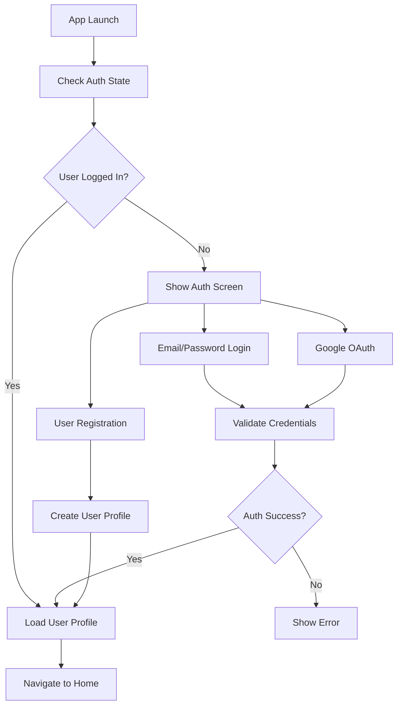

# 🚀 WePark - Appwrite Backend Implementation Guide

## 🎯 **PROJECT STATUS: READY FOR APPWRITE**

✅ **ALL Firebase/Backend code has been COMPLETELY REMOVED**  
✅ **Clean project structure ready for Appwrite implementation**  
✅ **All dependencies cleaned and optimized**  
✅ **UI components ready with placeholder authentication**

---

## 🏗️ **APPWRITE BACKEND ARCHITECTURE**

WePark will use **Appwrite** as the complete Backend-as-a-Service (BaaS) solution providing:

- **🔐 Authentication**: Email/Password, OAuth providers (Google, GitHub)
- **💾 Database**: NoSQL collections with real-time subscriptions  
- **💳 Storage**: File upload/download with permissions
- **⚡ Functions**: Serverless cloud functions
- **📊 Realtime**: Live data synchronization
- **🛡️ Security**: Role-based access control & permissions

---

## 📱 **SUPPORTED APPLICATIONS**

This Appwrite backend will support:
1. **📱 User Mobile App** - Flutter mobile app for parking users
2. **💻 Admin Web Panel** - Flutter web app for administrators  
3. **📟 Attendant Tablet App** - Flutter tablet app for parking attendants

---

## 🚀 **APPWRITE SETUP INSTRUCTIONS**

### **STEP 1: Create Appwrite Project**

#### **Option A: Appwrite Cloud (Recommended)**
```bash
# 1. Go to https://cloud.appwrite.io/
# 2. Create new account
# 3. Create new project: "wepark-smart-parking"
# 4. Note your Project ID and API Endpoint
```

#### **Option B: Self-Hosted Appwrite**
```bash
# Install Docker and Docker Compose
docker --version
docker-compose --version

# Clone Appwrite
git clone https://github.com/appwrite/appwrite.git
cd appwrite

# Start Appwrite
docker-compose up -d --remove-orphans

# Access Appwrite Console: http://localhost
```

### **STEP 2: Configure Flutter Dependencies**

Add Appwrite to your `packages/shared/pubspec.yaml`:

```yaml
dependencies:
  # Appwrite Backend
  appwrite: ^11.0.1
  
  # State Management  
  flutter_riverpod: ^2.5.1
  
  # Environment Variables
  flutter_dotenv: ^5.1.0
  
  # Existing dependencies...
```

### **STEP 3: Environment Configuration**

Create `packages/shared/.env`:
```env
# Appwrite Configuration
APPWRITE_ENDPOINT=https://cloud.appwrite.io/v1
APPWRITE_PROJECT_ID=your-project-id
APPWRITE_API_KEY=your-api-key

# App Configuration
APP_NAME=WePark
APP_VERSION=1.0.0

# Google Maps (unchanged)
GOOGLE_MAPS_API_KEY=your-google-maps-key

# Payment Gateway (unchanged) 
CHAPA_PUBLIC_KEY=your-chapa-public-key
CHAPA_SECRET_KEY=your-chapa-secret-key
```

### **STEP 4: Appwrite Database Schema**

#### **Collections to Create:**

```javascript
// 1. Users Collection
{
  "collectionId": "users",
  "name": "Users",
  "permissions": {
    "read": ["role:all"],
    "create": ["role:all"],
    "update": ["role:user"],
    "delete": ["role:admin"]
  },
  "attributes": [
    {
      "key": "email",
      "type": "string",
      "size": 320,
      "required": true
    },
    {
      "key": "fullName", 
      "type": "string",
      "size": 100,
      "required": true
    },
    {
      "key": "phoneNumber",
      "type": "string", 
      "size": 20,
      "required": false
    },
    {
      "key": "role",
      "type": "string",
      "size": 20,
      "required": true,
      "default": "user"
    },
    {
      "key": "isActive",
      "type": "boolean",
      "required": true,
      "default": true
    },
    {
      "key": "profileImageUrl",
      "type": "string",
      "size": 255,
      "required": false
    },
    {
      "key": "createdAt",
      "type": "datetime",
      "required": true
    },
    {
      "key": "updatedAt", 
      "type": "datetime",
      "required": true
    }
  ]
}

// 2. Parking Locations Collection
{
  "collectionId": "parking_locations",
  "name": "Parking Locations", 
  "permissions": {
    "read": ["role:all"],
    "create": ["role:admin"],
    "update": ["role:admin"],  
    "delete": ["role:admin"]
  },
  "attributes": [
    {
      "key": "name",
      "type": "string",
      "size": 100,
      "required": true
    },
    {
      "key": "address",
      "type": "string", 
      "size": 255,
      "required": true
    },
    {
      "key": "latitude",
      "type": "double",
      "required": true
    },
    {
      "key": "longitude", 
      "type": "double",
      "required": true
    },
    {
      "key": "totalSpots",
      "type": "integer",
      "required": true
    },
    {
      "key": "availableSpots",
      "type": "integer", 
      "required": true
    },
    {
      "key": "hourlyRate",
      "type": "double",
      "required": true
    },
    {
      "key": "isActive",
      "type": "boolean",
      "required": true,
      "default": true
    },
    {
      "key": "amenities",
      "type": "string",
      "size": 500,
      "required": false
    },
    {
      "key": "images",
      "type": "string",  
      "size": 1000,
      "required": false
    }
  ]
}

// 3. Bookings Collection  
{
  "collectionId": "bookings",
  "name": "Bookings",
  "permissions": {
    "read": ["role:user", "role:admin"],
    "create": ["role:user"],
    "update": ["role:user", "role:admin"],
    "delete": ["role:admin"]
  },
  "attributes": [
    {
      "key": "userId", 
      "type": "string",
      "size": 36,
      "required": true
    },
    {
      "key": "parkingLocationId",
      "type": "string",
      "size": 36, 
      "required": true
    },
    {
      "key": "spotNumber",
      "type": "string",
      "size": 10,
      "required": true
    },
    {
      "key": "vehiclePlateNumber",
      "type": "string",
      "size": 20,
      "required": true
    },
    {
      "key": "startTime",
      "type": "datetime",
      "required": true
    },
    {
      "key": "endTime", 
      "type": "datetime",
      "required": true
    },
    {
      "key": "totalAmount",
      "type": "double",
      "required": true
    },
    {
      "key": "status",
      "type": "string",
      "size": 20,
      "required": true,
      "default": "pending"
    },
    {
      "key": "paymentStatus",
      "type": "string",
      "size": 20, 
      "required": true,
      "default": "pending"
    },
    {
      "key": "qrCode",
      "type": "string",
      "size": 255,
      "required": false
    }
  ]
}
```

---

## 🔧 **IMPLEMENTATION ROADMAP**

### **Phase 1: Authentication Setup** ⏱️ 2-3 days
- [ ] Setup Appwrite client configuration
- [ ] Implement email/password authentication
- [ ] Create user registration with profile  
- [ ] Add Google OAuth integration
- [ ] Setup user roles and permissions

### **Phase 2: Database Integration** ⏱️ 3-4 days  
- [ ] Create database collections
- [ ] Implement user profile management
- [ ] Setup parking locations CRUD
- [ ] Create booking system with real-time updates
- [ ] Add data validation and security rules

### **Phase 3: Advanced Features** ⏱️ 4-5 days
- [ ] File storage for profile images & documents
- [ ] Real-time parking availability updates  
- [ ] QR code generation and validation
- [ ] Push notifications via Appwrite Functions
- [ ] Payment gateway integration (Chapa)

### **Phase 4: Testing & Optimization** ⏱️ 2-3 days
- [ ] Comprehensive testing across all apps
- [ ] Performance optimization  
- [ ] Security audit
- [ ] Documentation completion

---

## 📁 **CLEAN PROJECT STRUCTURE**

```
packages/
├── shared/
│   ├── lib/src/
│   │   ├── config/
│   │   │   ├── appwrite_config.dart     # 🆕 Appwrite client setup
│   │   │   ├── env_config.dart          # 🆕 Environment variables
│   │   │   └── payment_config.dart      # ✅ Existing
│   │   ├── services/
│   │   │   ├── auth/
│   │   │   │   └── auth_service.dart    # 🆕 Appwrite authentication
│   │   │   ├── database/
│   │   │   │   └── database_service.dart # 🆕 Appwrite database
│   │   │   ├── storage/
│   │   │   │   └── storage_service.dart # 🆕 Appwrite storage
│   │   │   └── realtime/
│   │   │       └── realtime_service.dart # 🆕 Appwrite realtime
│   │   ├── models/
│   │   │   ├── user/
│   │   │   │   └── user.dart           # 🆕 Clean user model
│   │   │   ├── parking/
│   │   │   │   ├── parking_location.dart # ✅ Existing  
│   │   │   │   └── parking_spot.dart   # ✅ Existing
│   │   │   └── booking/
│   │   │       └── booking.dart        # ✅ Existing
│   │   └── providers/
│   │       ├── auth_providers.dart      # 🆕 Authentication state
│   │       ├── database_providers.dart  # 🆕 Database state  
│   │       └── user_providers.dart      # 🆕 User management
│   └── .env                            # 🆕 Appwrite configuration
└── apps/
    └── user_app/
        ├── lib/src/
        │   ├── screens/auth/           # ✅ Ready for Appwrite
        │   ├── screens/home/           # ✅ Clean UI ready
        │   └── screens/booking/        # ✅ Ready for backend
        └── pubspec.yaml               # ✅ Clean dependencies
```

---

## 🎨 **AUTHENTICATION FLOW DESIGN**



---

## 💡 **KEY ADVANTAGES OF APPWRITE**

- ✅ **Open Source**: Full control and transparency
- ✅ **Real-time**: Live data synchronization out of the box  
- ✅ **Multi-platform**: Perfect for Flutter projects
- ✅ **Self-hosted Option**: Deploy anywhere you want
- ✅ **Built-in Security**: RBAC, JWT, encryption included
- ✅ **Developer Friendly**: Great documentation and community
- ✅ **Cost Effective**: Generous free tier, predictable pricing
- ✅ **Scalable**: Handles growth from startup to enterprise

---

## 🔒 **SECURITY CONSIDERATIONS**

### **Authentication Security**
- Password strength requirements
- Email verification mandatory
- Session management with JWT
- Multi-factor authentication (future)

### **Database Security** 
- Role-based access control (RBAC)
- Collection-level permissions
- User can only access their own data
- Admins have elevated permissions

### **API Security**
- API key restrictions by domain
- Rate limiting enabled
- Input validation and sanitization  
- HTTPS enforcement

---

## 🚀 **NEXT STEPS**

1. **Setup Appwrite Project** (30 minutes)
   - Create cloud account or self-host
   - Configure project settings
   - Generate API keys

2. **Implement Authentication** (1-2 days)
   - Email/password auth
   - User registration flow
   - Google OAuth integration

3. **Database Integration** (2-3 days) 
   - Create collections
   - Implement CRUD operations
   - Real-time subscriptions

4. **Advanced Features** (3-4 days)
   - File storage
   - Push notifications
   - Payment integration

---

**🎯 TOTAL ESTIMATED TIME: 7-10 days for complete implementation**

**Ready to start? Let's build something amazing with Appwrite! 🚀**
